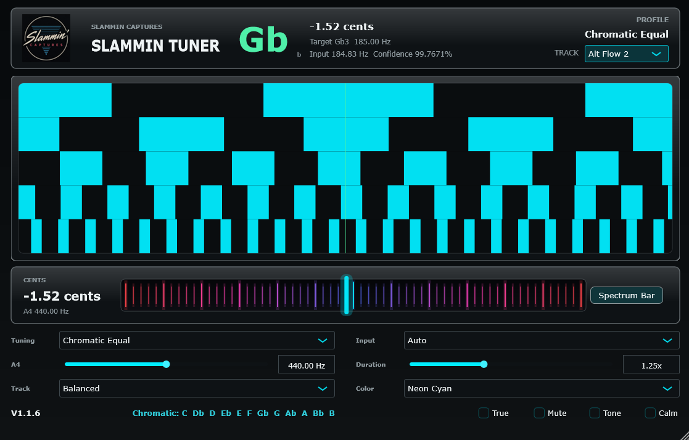

# Slammin Tuner



Slammin Tuner is a realtime strobe tuner plugin from Slammin Captures. Version `1.1.6` is built from JUCE `8.0.12` and ships with a Windows VST3 build plus a macOS Audio Unit build path for Logic Pro and other AU hosts.

## Downloads

Use the GitHub Releases page for packaged builds:

- Windows: `Slammin-Tuner-v1.1.6-Windows-VST3.zip`
- macOS: `Slammin-Tuner-v1.1.6-macOS-AU-universal.zip`

## macOS AU Strategy

The macOS AU is not converted from the Windows VST3 binary. That is not a reliable or professional plugin distribution method. Instead, the same Slammin Tuner source is compiled on macOS through JUCE's Audio Unit target.

The release workflow builds a universal AU with both slices:

- `arm64` for Apple Silicon Macs
- `x86_64` for Intel Macs

The CI pipeline validates the AU with:

- `lipo -verify_arch arm64 x86_64`
- `plutil -lint` on the AU `Info.plist`
- ad-hoc `codesign` for local AU registration
- install into `~/Library/Audio/Plug-Ins/Components`
- `auval -v aufx ST26 SLMN`

OpenGL-backed painting is disabled for macOS builds to keep the AU editor conservative for Logic Pro and other macOS hosts.

## Build Locally

### Windows VST3

```powershell
cmake -S . -B build-windows -G "Visual Studio 17 2022" -A x64 -DSLAMMIN_TUNER_FORMATS=VST3
cmake --build build-windows --config Release --target SlamminTunerV1_VST3
```

### macOS AU Universal

```bash
./scripts/package_macos_au.sh
```

This configures a universal `arm64;x86_64` AU build, validates it with `auval`, and creates a zip in `artifacts/`.

## Controls

- **Tuning**: Built-in tuning profile selector.
- **A4**: Reference pitch in Hz. Manual entries are interpreted as Hz and clamped to the supported range.
- **Track**: Pitch-tracking behavior. `Balanced` is the default, `Fast` reacts quicker, and `Precision` smooths more heavily.
- **Input**: `Auto`, `Left`, `Right`, or `Mid`.
- **Duration**: Strobe response length. Manual entries are interpreted as `x` and clamped to the supported range.
- **Color**: Fifteen stage-ready accent colors including neon cyan, neon pink, electric green, blue, amber, violet, red, mint, white, gold, orange, teal, purple, steel, and warm ivory.
- **True**: Fully band-resolved strobe mode. Each row estimates the same note through a different harmonic band; row brightness reflects confidence/energy in that band.
- **Mute**: Mutes passthrough audio unless the reference tone is active.
- **Tone**: Generates a quiet reference tone at the current target note.
- **Calm**: Reduced-motion display mode.
- **Spectrum Bar**: Switches the lower tuner bar between the red/blue spectrum look and a selected-color contrast style.
- **Note Name Click**: Click the large note name to toggle flat/sharp spelling.
- **Logo Click**: Opens Slammin Captures links in the external browser.

## Strobe Modes

- **Same Flow 1**: All strobe rows move in the same direction with the shaded block style.
- **Same Flow 2**: All rows move in the same direction with solid flush-row blocks.
- **Alt Flow 1**: Alternating rows move in opposite directions with the shaded block style.
- **Alt Flow 2**: Alternating rows move in opposite directions with solid flush-row blocks. This is the default.

## Built-In Tunings

Chromatic Equal, Guitar Standard, Half-Step Down, Full-Step Down, C# Standard, C Standard, Drop D, Drop Db, Drop C, Drop B, Drop A, DADGAD, Open G, Open D, Open E, Open C, Open A, Open F, Open B, Open D Minor, Open G Minor, All Fourths, Nashville High, Baritone B, Shelf Sweetener, VH Half-Flat, 7 String Guitar, 7 String Drop A, 7 String Half Down, 6 String Bass, Bass Drop D, and 5 String Bass.

## Links

- [Slammin Captures Store](https://slammincaptures.bigcartel.com/)
- [Ko-fi Shop](https://ko-fi.com/slammincaptures/shop)
- [Tone3000 Profile](https://www.tone3000.com/slamminmofo)

